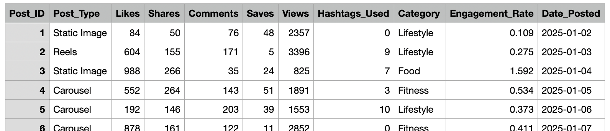
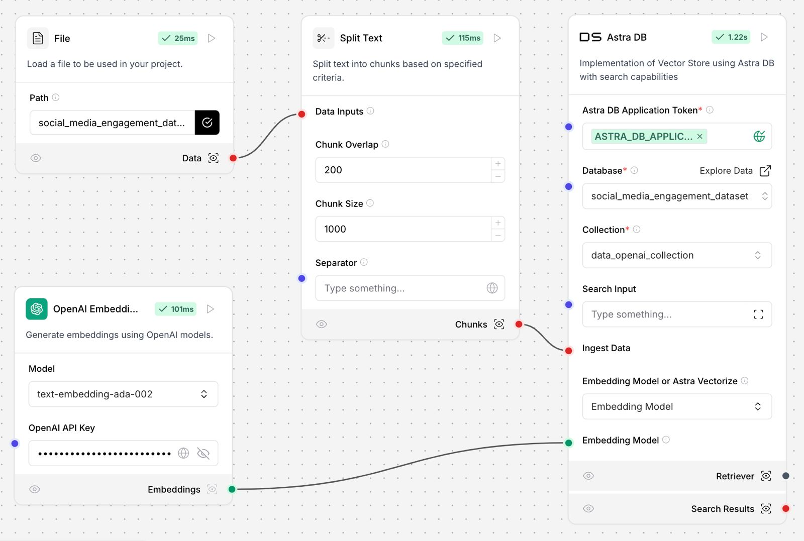
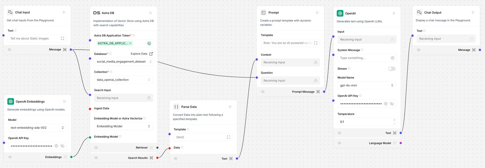
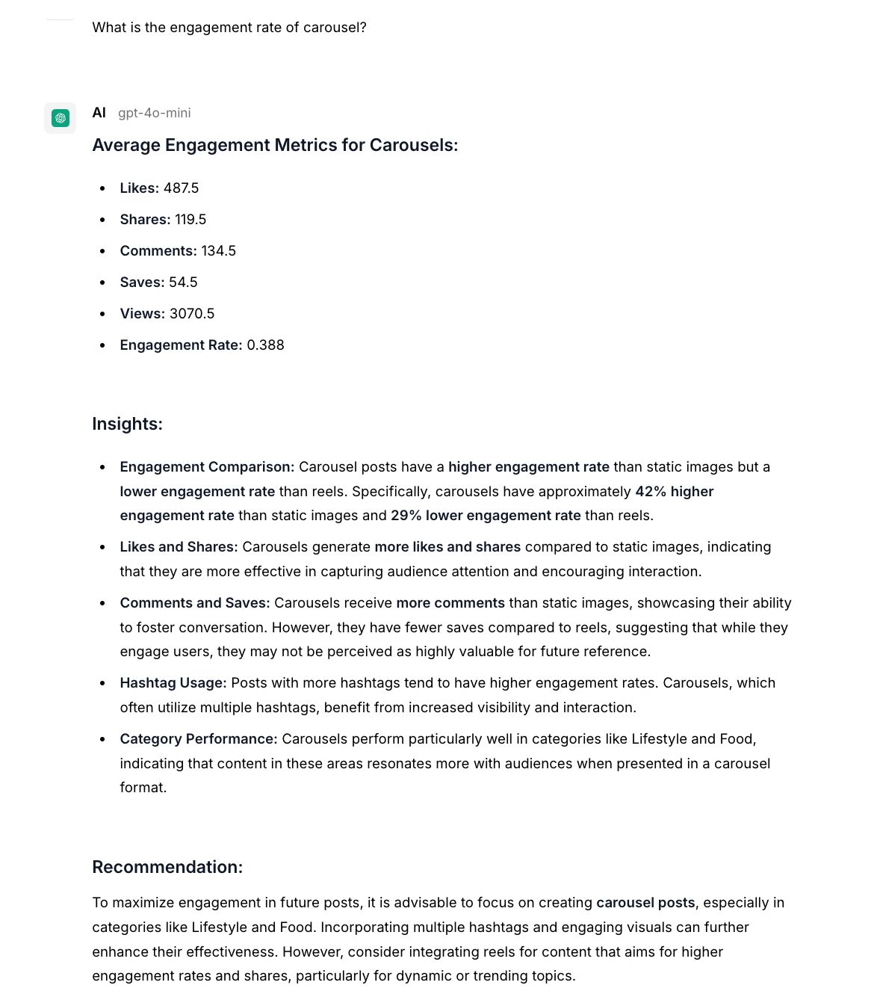

# SocialSight - Social Media Performance Analysis

## Pre-Hackathon Assignment for Level SuperMind Hackathon

### Overview 
SocialSight is a basic analytics module designed to analyze engagement data from mock social media accounts. The project utilizes Langflow and DataStax Astra DB to fetch, store, and analyze engagement metrics, providing insightful performance insights using GPT integration. 📊✨

### Live Demo
- **Live Website**: [EngageInsight Analytics](https://yourwebsite.com) 🌐
- **Demo Video**: [Watch the Demo](https://youtu.be/demo_video_link) 🎬

### Tools and Tech Stack
- **DataStax Astra DB**: For database operations to store and query social media engagement data.
- **Langflow**: For workflow creation and GPT integration to generate insights.

# {AAKASH ADD THE TECHSTACK FOR THE FRONTEND AND BACKEND}

### Features
1. **Fetch Engagement Data**:
   - Create a dataset simulating social media engagement (likes, shares, comments, post types, etc.).
   - Store the dataset in DataStax Astra DB.

2. **Analyze Post Performance**:
   - Use Langflow to construct a flow that accepts post types (carousel, reels, static images) as input.
   - Query the Astra DB dataset to calculate average engagement metrics for each post type.

3. **Provide Insights**:
   - Utilize GPT integration (gpt-4o-mini) in Langflow to generate insights based on the engagement data, complete with helpful recommendations for the next viral post. ✨🚀

### Screenshots
- **Dataset Screenshot**: 
- **Langflow Agent Workflow**:  
- **Sample Output**: 

### Installation and Setup
1. Clone the repository:
   ```bash
   git clone https://github.com/yourusername/engageinsight-analytics.git
   ```

2. Install the required dependencies:
   ```bash
   pip install -r requirements.txt
   ```

# {AAKASH SEE IF YOU CAN WRITE THE INSTALLATION AND SETUP PART}
